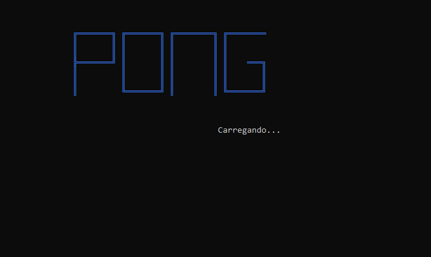

# Pong

Inspirado no famoso jogo de Atari, Pong foi desenvolvido quando estava começando a aprender a programar. É um código bem amador e com diversas falhas, mas que significou muito ao começar a programar.




## Instalando e rodando

Desenvolvido somente para Windows.

Você vai precisar ter instalado:
* [Git](https://git-scm.com/downloads)*
* Compilador C, exemplo: [MinGW](http://www.mingw.org/)

Clonar o repositório:
```
git clone https://github.com/MatheusBurda/Pong.git
```

*Ou baixe o código no botão verde no topo da página e extraia os arquivos.

Rodando o jogo:
```
cd Pong # Muda para o diretório que está o projeto
gcc pong.c -o pong # Compila o arquivo
./pong # Roda o jogo
```

E é só se divertir agora!

## Autor

* **[Matheus Burda](https://github.com/MatheusBurda)** - *start to end* 

## Licença

This project is licensed under the MIT License - see the [LICENSE.md](LICENSE.md) file for details